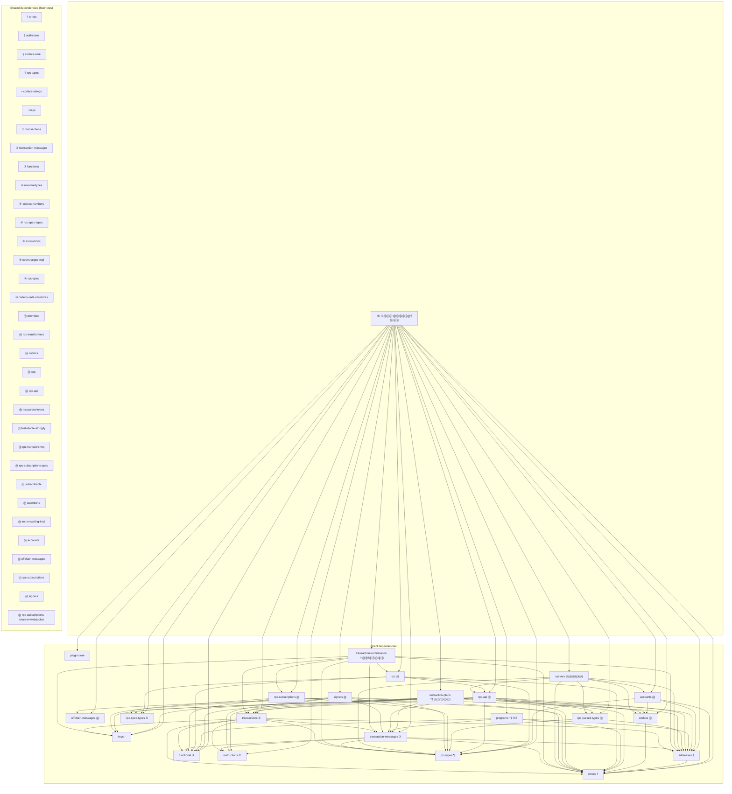

Kit is developed in public and we encourage and appreciate contributions.

## Getting Started

1. Install dependencies: `pnpm install`
2. The first time you build Kit, you will need to install the Agave test validator, which is used for some tests. `pnpm test:setup`
3. Start a test validator before running tests. `./scripts/start-shared-test-validator.sh`
4. Build + test all packages: `pnpm build`

## Development Environment

Kit is developed as a monorepo using [pnpm](https://pnpm.io/) and [turborepo](https://turborepo.com/).

Often your changes will only apply to a single package. You can run tests for a single package and watch for changes:

```shell
cd packages/accounts
pnpm turbo compile:js compile:typedefs
pnpm dev
```

## Package dependencies (Mermaid)

Dependency diagram for `@solana/kit` and its direct dependencies. **Kit** is at the center with all direct dependency packages around it; an arrow A → B means A depends on B. Packages that are depended on by more than one other appear in the **Shared dependencies** box (no arrows); footnote symbols on a package indicate which of those shared dependencies it uses.


